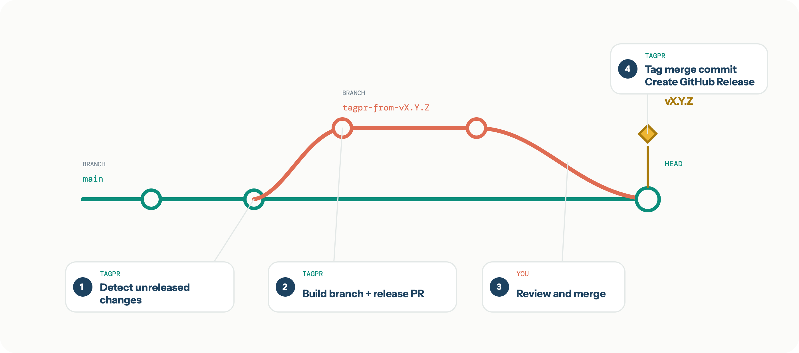

# tagpr

[][actions]
[][license]
[][PkgGoDev]

tagpr continuously prepares a release pull request for unreleased changes. When you
merge that pull request, tagpr tags the merged commit and optionally creates a GitHub
Release.

Release preparation stays automated, visible, and reviewable:

- The proposed version, changelog, and project-specific release changes live in a pull
  request.
- The release pull request follows new changes on your release branch until you are
  ready to release.
- Releasing is an explicit merge operation instead of a sequence of local commands.
- Publishing or deployment can run after tagpr creates the tag.

tagpr supports Semantic Versioning (SemVer) by default, Calendar Versioning (CalVer),
tag-only releases, monorepos, and maintenance branches for older major versions.

## How it works

### Create, review, and release

1. tagpr detects unreleased changes when a push advances the release branch, normally
   `main`.
2. tagpr creates or rebuilds a temporary branch, then creates or updates a release pull
   request. By default, it updates the version file and `CHANGELOG.md`.
3. You review the generated and project-specific release changes, then merge the pull
   request when you are ready to release.
4. On the next run, tagpr tags the merge commit at the head of `main` and creates a
   GitHub Release unless configured otherwise.



### Keep the release pull request current

If the release pull request remains open and `main` advances again, tagpr automatically
updates it. tagpr rebuilds the temporary branch from the latest `main`, producing a
rebase-like result without requiring a manual rebase.

### Adjust the release pull request

You can edit the release pull request directly. For example, you can adjust the proposed
version, update dependencies, or add files that your project requires at release time.
These repeatable changes can also be automated with `tagpr.command` or
`tagpr.postVersionCommand`. See
[Release preparation commands](docs/guides/release-commands.md) for execution order and
examples.

When tagpr updates the pull request after `main` advances, it carries additional commits
on the release branch forward as far as possible. See
[Release flow and design](docs/concepts/release-flow.md) for the detailed update graph.

### Merge when you are ready

You do not need to merge the release pull request immediately. Leave it open until you
want to release; tagpr will keep it current as `main` advances. Having one continuously
open release pull request is the expected workflow. Alternatively, merge it frequently
and ship smaller releases—small, incremental releases are often easier to review and
adopt.

## Documentation

- [Documentation index](docs/index.md)
- [Getting started](docs/getting-started.md)
- [Release flow and design](docs/concepts/release-flow.md)
- [Versioning and label rules](docs/guides/versioning.md)
- [Changelog and GitHub Releases](docs/guides/changelog-and-releases.md)
- [Release preparation commands](docs/guides/release-commands.md)
- [Publishing after a release](docs/guides/publish-after-release.md)
- [Configuration index](docs/reference/configuration.md)
- [Release pull request templates](docs/reference/templates.md)

## Quickstart

tagpr is designed to run in GitHub Actions. Add the following workflow to a repository
that releases from `main`:

```yaml
# .github/workflows/tagpr.yml
name: tagpr
on:
  push:
    branches: ["main"]

permissions:
  contents: write
  pull-requests: write
  issues: read

jobs:
  tagpr:
    runs-on: ubuntu-latest
    steps:
    - uses: actions/checkout@v6
      with:
        persist-credentials: false
    - uses: Songmu/tagpr@v1
      env:
        GITHUB_TOKEN: ${{ secrets.GITHUB_TOKEN }}
```

In the target repository, open **Settings > Actions > General > Workflow permissions**
and enable **Allow GitHub Actions to create and approve pull requests**.

Commit the workflow and push it to `main`. On its first run, tagpr:

1. Finds the latest SemVer tag, or starts from `v0.0.0` if the repository has no release
   tag.
2. Creates `.tagpr` if it does not exist and detects a likely version file.
3. Creates `.github/release.yml` if neither `.github/release.yml` nor
   `.github/release.yaml` exists.
4. Creates a release pull request for the unreleased changes.

Review the generated `.tagpr` file after the first run. In particular, verify that
`tagpr.versionFile` points to the files that contain your project's version.

### Tag-only releases

If your project does not keep its version in a file, configure tagpr to use Git tags
only:

```ini
[tagpr]
    versionFile = -
```

### Using a different release branch

Set the branch in both the workflow trigger and `.tagpr`:

```ini
[tagpr]
    releaseBranch = production
```

## What the release pull request contains

By default, tagpr updates:

- the version file or files configured by `tagpr.versionFile`; and
- `CHANGELOG.md`, using GitHub's generated release notes and
  `.github/release.yml`.

tagpr calls GitHub's
[Generate release notes API][github-generate-release-notes-api] with the previous tag,
release branch, and configured release-note file. Therefore, changelog entries and the
GitHub Release body follow GitHub's generated release-note rules, including the
categories and exclusions in `.github/release.yml` or `.github/release.yaml`. See
[Changelog and GitHub Releases](docs/guides/changelog-and-releases.md) for the complete
flow.

You can customize these changes:

- Set `tagpr.changelog = false` to leave the changelog unchanged.
- Set `tagpr.command` to run a project-specific command before version files are
  updated.
- Set `tagpr.postVersionCommand` to run a command after version files are updated.
- Set `tagpr.template` or `tagpr.templateText` to customize the release pull request.
- Commit manual release changes directly to the generated release branch.

See [Release pull request templates](docs/reference/templates.md) for the available
template variables and examples.

## Choosing the next version

### Semantic Versioning

tagpr proposes the next SemVer version as follows:

1. It finds the latest SemVer tag that matches `tagpr.tagPrefix`. If no tag exists,
   tagpr compares changes from the first commit and uses `v0.0.0` as the current
   version.
2. It inspects pull requests merged since the last release. If a pull request has a
   label configured in `tagpr.majorLabels` or `tagpr.minorLabels`, tagpr adds
   `tagpr:major` or `tagpr:minor` to the release pull request.
3. A `tagpr:major` or `tagpr/major` label on the release pull request selects a major
   bump. A `tagpr:minor` or `tagpr/minor` label selects a minor bump. Otherwise, tagpr
   proposes a patch bump. Major takes precedence when both labels are present.
4. If you edit the configured version file in the release pull request, that version
   takes precedence over the labels when the pull request is merged.

tagpr always adds the `tagpr` label to its own release pull request. Labels on pull
requests created by `dependabot[bot]` are ignored when determining the next project
version, because those labels describe the dependency's version change rather than the
project's.

See [Versioning and label rules](docs/guides/versioning.md) for custom label mappings,
tag-only releases, CalVer behavior, and monorepo scoping.

### Calendar Versioning

Set `tagpr.calendarVersioning` to use a date-based version instead of SemVer:

```ini
[tagpr]
    calendarVersioning = true
```

`true` uses `YYYY.MM0D.MICRO`. You can also specify a custom format such as
`YYYY.0M.MICRO`. Major and minor labels are ignored in CalVer mode. See
[tagpr.calendarVersioning](#tagprcalendarversioning-optional) for the complete token
reference.

## Publishing or deploying after a release

tagpr exposes a `tag` output only when it creates a tag. Use it to conditionally run a
publishing or deployment step in the same workflow:

```yaml
- uses: actions/checkout@v6
  with:
    persist-credentials: false
- id: tagpr
  uses: Songmu/tagpr@v1
  env:
    GITHUB_TOKEN: ${{ secrets.GITHUB_TOKEN }}
- name: Publish
  if: steps.tagpr.outputs.tag != ''
  run: ./scripts/publish "${{ steps.tagpr.outputs.tag }}"
```

### Triggering a separate workflow

Events created with the repository's `GITHUB_TOKEN` do not start another GitHub Actions
workflow. This prevents accidental recursive workflow runs. Therefore, a tag created by
tagpr with `GITHUB_TOKEN` will not trigger a separate tag-based release workflow.

If the tag must trigger another workflow, use a token from a GitHub App or another token
that has the required repository permissions. A GitHub App installation token is
recommended because it is short-lived. For simplicity, the following example uses a
personal access token stored as `GH_PAT`:

```yaml
name: tagpr
on:
  push:
    branches: ["main"]

permissions:
  contents: write
  pull-requests: write
  issues: read

jobs:
  tagpr:
    runs-on: ubuntu-latest
    steps:
    - uses: actions/checkout@v6
      with:
        token: ${{ secrets.GH_PAT }}
        persist-credentials: false
    - uses: Songmu/tagpr@v1
      env:
        GITHUB_TOKEN: ${{ secrets.GH_PAT }}
```

See GitHub's documentation on
[triggering a workflow from a workflow][github-token-trigger] for the underlying token
behavior.

## Common configurations

### Multiple version files

Separate multiple paths with commas:

```ini
[tagpr]
    versionFile = version.go,action.yml
```

### Monorepos

`tagpr.tagPrefix` scopes tags and release history for independently versioned projects
in a monorepo. A project can keep its configuration in its own directory:

```yaml
- uses: Songmu/tagpr@v1
  with:
    config: tools/.tagpr
  env:
    GITHUB_TOKEN: ${{ secrets.GITHUB_TOKEN }}
```

Paths inside `tools/.tagpr` are still relative to the repository root, not to the
directory containing `.tagpr`. Include the project directory in each path:

```ini
# tools/.tagpr
[tagpr]
    tagPrefix = tools
    versionFile = tools/package.json
    changelogFile = tools/CHANGELOG.md
    releaseYAMLPath = tools/.github/release.yml
```

This configuration creates tags such as `tools/v1.2.3`.

### Maintaining an older major version

Use `tagpr.fixedMajorVersion` on a maintenance branch so tagpr considers only tags for
that major version:

```ini
[tagpr]
    releaseBranch = v1
    fixedMajorVersion = 1
```

`fixedMajorVersion` cannot be combined with `calendarVersioning`.

## Configuration reference

tagpr reads `.tagpr` from the repository root in Git config format:

```ini
[tagpr]
    releaseBranch = main
    versionFile = version.go
    changelog = true
    release = draft
```

Every setting can also be supplied through its corresponding `TAGPR_*` environment
variable. Environment variables take precedence over values in `.tagpr`. The GitHub
Action's `config` input or `TAGPR_CONFIG_FILE` can select a different configuration
file.

### Path resolution

Relative paths in the configuration are resolved from tagpr's working directory, not
from the directory containing the configuration file. The GitHub Action runs tagpr from
`GITHUB_WORKSPACE`, so these paths are relative to the repository root:

- `tagpr.versionFile`
- `tagpr.changelogFile`
- `tagpr.releaseYAMLPath`
- `tagpr.template`

`tagpr.command` and `tagpr.postVersionCommand` also run from the repository root. If
`tagpr.versionFile` is omitted, automatic detection scans from the repository root.

For example, when `config: tools/.tagpr` is used, write
`versionFile = tools/package.json`, not `versionFile = package.json`.

### Release target and version files

#### tagpr.releaseBranch

The branch from which releases are made. tagpr tracks this branch, creates or updates
its release pull request, and tags the commit after that pull request is merged. The
workflow's push trigger must include this branch.

Environment variable: `TAGPR_RELEASE_BRANCH`.

#### tagpr.versionFile

One or more comma-separated files that hold the version. tagpr writes the proposed
version when preparing the release pull request and reads it at merge time, so a manual
edit in the pull request determines the final tag.

If the setting is absent or empty, tagpr scans the repository for a likely version file.
Set it to `-` to rely on Git tags only.

Environment variable: `TAGPR_VERSION_FILE`.

#### tagpr.vPrefix

Whether to add `v` before a SemVer tag, for example `v1.2.3`. This setting controls only
the Git tag format, not the value written to the version file.

Environment variable: `TAGPR_VPREFIX`.

#### tagpr.tagPrefix (Optional)

A path-like prefix for independently versioned projects in a monorepo. For example,
`tools` produces tags such as `tools/v1.2.3`, and `backend/api` produces tags such as
`backend/api/v1.0.0`.

Environment variable: `TAGPR_TAG_PREFIX`.

#### tagpr.fixedMajorVersion (Optional)

Restricts releases to one major version. This is useful for maintaining branches such
as `v1` while `main` releases v2. Both `1` and `v1` are accepted. This option cannot be
used with `tagpr.calendarVersioning`.

Environment variable: `TAGPR_FIXED_MAJOR_VERSION`.

### Version selection

#### tagpr.majorLabels (Optional)

Comma-separated labels on merged pull requests that indicate a major update. The
default is `major`.

Environment variable: `TAGPR_MAJOR_LABELS`.

#### tagpr.minorLabels (Optional)

Comma-separated labels on merged pull requests that indicate a minor update. The
default is `minor`.

Environment variable: `TAGPR_MINOR_LABELS`.

#### tagpr.calendarVersioning (Optional)

Enables Calendar Versioning. Set it to `true` for the default format
`YYYY.MM0D.MICRO`, or specify a custom format.

Available format tokens follow [CalVer](https://calver.org/):

- Year: `YYYY` (four digits), `YY` (two digits), `0Y` (zero-padded two digits)
- Month: `MM` (not padded), `0M` (zero-padded)
- Week: `WW` (not padded), `0W` (zero-padded)
- Day: `DD` (not padded), `0D` (zero-padded)
- Micro: `MICRO` (auto-incremented for the same date)

Examples:

- `true` or `YYYY.MM0D.MICRO` produces a version such as `2026.1203.0`.
- `YYYY.0M.MICRO` produces a version such as `2026.01.0`.
- `YY.0M0D.MICRO` produces a version such as `26.0123.0`.

Environment variable: `TAGPR_CALENDAR_VERSIONING`.

### Generated files and commands

#### tagpr.changelog (Optional)

Whether to create or update the changelog. Changelog generation is enabled by default.

Environment variable: `TAGPR_CHANGELOG`.

#### tagpr.changelogFile (Optional)

The changelog path. The default is `CHANGELOG.md`.

Environment variable: `TAGPR_CHANGELOG_FILE`.

#### tagpr.releaseYAMLPath (Optional)

The GitHub generated release-notes configuration used to build the changelog and GitHub
Release. If this setting is absent, tagpr uses `.github/release.yml` or
`.github/release.yaml` and creates `.github/release.yml` on the first run if neither
file exists.

Environment variable: `TAGPR_RELEASE_YAML_PATH`.

#### tagpr.command (Optional)

A command to run before tagpr updates the version file.

Environment variable: `TAGPR_COMMAND`.

#### tagpr.postVersionCommand (Optional)

A command to run after tagpr updates the version file.

Environment variable: `TAGPR_POST_VERSION_COMMAND`.

Both commands receive:

- `TAGPR_CURRENT_VERSION`: the current version tag, for example `v1.2.3`
- `TAGPR_NEXT_VERSION`: the proposed version tag, for example `v1.3.0`

See [Release preparation commands](docs/guides/release-commands.md) for execution order,
working-directory behavior, repeated runs, and generated-file handling.

### Release pull request

#### tagpr.template (Optional)

The path to a Go text template used for the release pull request title and body. The
first rendered line becomes the title and the remaining content becomes the body. See
[Release pull request templates](docs/reference/templates.md).

Environment variable: `TAGPR_TEMPLATE`.

#### tagpr.templateText (Optional)

An inline Go text template used for the release pull request title and body. It is used
only when `tagpr.template` is not set.

Environment variable: `TAGPR_TEMPLATE_TEXT`.

#### tagpr.commitPrefix (Optional)

The prefix for commits created by tagpr. The default is `[tagpr]`.

Environment variable: `TAGPR_COMMIT_PREFIX`.

### GitHub Release

#### tagpr.release (Optional)

Controls GitHub Release creation after tagging:

- `true` creates and publishes the release. This is the default.
- `draft` creates a draft release.
- `false` does not create a GitHub Release.

Environment variable: `TAGPR_RELEASE`.

## GitHub Action reference

### Inputs

#### config (Optional)

The path to the tagpr configuration file. The default is `.tagpr`.

#### version (Optional)

The version of the tagpr executable installed by the action. The action supplies a
tested default, so most workflows should leave this unset.

### Outputs

- `tag`: the created tag. It is empty when tagpr did not create a tag.
- `pull_request`: JSON describing the release pull request created or updated by tagpr.
- `base_tag`: the base version tag used for comparison. It is empty when no previous
  tag exists.

## GitHub Enterprise

For GitHub Enterprise, use `GH_ENTERPRISE_TOKEN` instead of `GITHUB_TOKEN`:

```yaml
- uses: Songmu/tagpr@v1
  env:
    GH_ENTERPRISE_TOKEN: ${{ secrets.GITHUB_TOKEN }}
```

## Troubleshooting

### tagpr cannot create a pull request

Check both the workflow `permissions` block and the repository's **Allow GitHub Actions
to create and approve pull requests** setting. tagpr needs `contents: write`,
`pull-requests: write`, and `issues: read`.

### A tag does not start another workflow

Tags created with `GITHUB_TOKEN` do not trigger another workflow. Run the publishing
step in the same workflow by checking the `tag` output, or use a GitHub App installation
token when a separate workflow is required.

### tagpr selected the wrong version file

Edit `tagpr.versionFile` in `.tagpr`. Use comma-separated paths for multiple files, or
`-` for tag-only releases. Commit the corrected configuration to the release pull
request.

### Files are not found when `.tagpr` is in a subdirectory

Configuration paths are relative to the repository root when using the GitHub Action;
they are not relative to the `.tagpr` file. For `config: tools/.tagpr`, use paths such
as `tools/package.json`, `tools/CHANGELOG.md`, and
`tools/.github/release.yml`.

If the problem persists, [open an issue][issues] with the workflow, `.tagpr`
configuration, relevant tags, and the tagpr log.

## Project links

- [GitHub Marketplace][marketplace]
- [Releases][releases]
- [Changelog](CHANGELOG.md)
- [Issues][issues]
- [Sponsor Songmu][sponsor]
- [MIT License][license]

## Author

[Songmu](https://github.com/Songmu)

[actions]: https://github.com/Songmu/tagpr/actions?workflow=test
[github-generate-release-notes-api]: https://docs.github.com/en/rest/releases/releases#generate-release-notes-content-for-a-release
[github-token-trigger]: https://docs.github.com/en/actions/how-tos/writing-workflows/choosing-when-your-workflow-runs/triggering-a-workflow
[issues]: https://github.com/Songmu/tagpr/issues
[license]: https://github.com/Songmu/tagpr/blob/main/LICENSE
[marketplace]: https://github.com/marketplace/actions/automate-pull-request-generation-and-tagging-for-releases-using-tagpr
[PkgGoDev]: https://pkg.go.dev/github.com/Songmu/tagpr
[releases]: https://github.com/Songmu/tagpr/releases
[sponsor]: https://github.com/sponsors/Songmu
