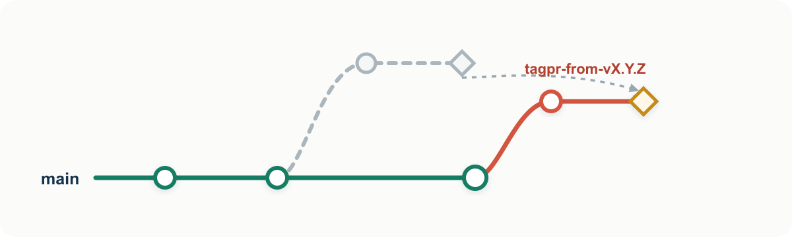

# Release flow and design

tagpr treats release preparation as a pull request and merging that pull request as the
release decision.

## Why a release pull request?

Software releases often require small but important changes that are easy to miss:

- choosing the next version;
- updating version files;
- preparing a changelog or release notes;
- updating dependencies or generated files;
- running project-specific preparation commands;
- tagging the correct commit.

When these steps are performed manually on one maintainer's machine, the process can
become implicit and difficult to review. tagpr moves preparation into a pull request so
the proposed release is visible to maintainers and contributors before it happens.

The pull request is both automation output and an escape hatch. tagpr prepares the
routine changes, while maintainers can commit any exceptional release work to the same
release PR branch.

## Design principles

- **Automate the proposal, not the decision.** tagpr prepares a candidate version,
  changelog, and file changes. Maintainers can review and adjust them before merging.
- **Use the normal pull request workflow.** Release knowledge should not live only in a
  maintainer's local commands. The same review and approval flow used for development
  also applies to release preparation.
- **Make the tag the release boundary.** Merging approves the release commit; tagging
  identifies it. Packaging and deployment can then consume that tag without becoming
  part of tagpr itself.
- **Reuse GitHub as the source of release information.** tagpr builds on merged pull
  requests, labels, generated release notes, GitHub Actions, and GitHub Releases instead
  of introducing a separate release database or workflow.

This keeps the release process visible before the release happens: maintainers and
users can see both the proposed contents and version in the open release pull request.

## Lifecycle

The **release branch** is the long-lived branch configured by `tagpr.releaseBranch`. It
is the base of the release pull request and receives the release commit. The **release
PR branch** is the temporary `tagpr-from-*` branch that tagpr manages as the pull
request head.

The following examples use `main` as the release branch.

### 1. Advancing main creates a release pull request

When `main` advances beyond the latest release tag, tagpr automatically creates a
release PR branch and a release pull request. By default, the pull request:

- proposes the next version;
- updates configured version files;
- updates the changelog from GitHub's generated release notes; and
- creates a release-note configuration when the repository has none.

The green line is the release branch, `main`, and the coral line is the release PR
branch. The numbered callouts distinguish tagpr's automated work from the maintainer's
review and merge decision. Because tagpr refreshes the release PR branch from the latest
`main`, the branch point and the merge result are adjacent on `main` in the graph. The
merge result is the new head; tagpr runs again, attaches the version tag to that commit,
and can also create a GitHub Release.

The graph is conceptual; tagpr supports all the GitHub merge methods, that is, **Create
a merge commit**, **Squash and merge**, and **Rebase and merge**.

### 2. An open release pull request follows main

If the release pull request remains open and `main` advances again, tagpr automatically
updates the pull request. It recreates the release PR branch from the latest `main` and
reapplies the release changes, producing a rebase-like result without requiring the
maintainer to rebase it manually.

In the diagram, the faded path is the previous branch state and the solid coral path is
the updated state.

### 3. Maintainers can adjust the release pull request

The release pull request is not read-only automation output. Maintainers can commit
directly to its release PR branch to perform work required before release, such as:

- selecting an exact version;
- editing release notes;
- updating dependencies or generated files; and
- changing other project-specific metadata.

Repeatable file changes can be automated with `tagpr.command`, which runs before version
files are updated, or `tagpr.postVersionCommand`, which runs afterward.
See [Release preparation commands](../guides/release-commands.md) for execution details.

When tagpr updates the pull request after `main` advances, it tries to preserve these
additional commits by carrying them forward onto the recreated release PR branch. The
diamond in the update diagram represents a manual commit preserved in this way.

After reviewing the automatically generated and manually adjusted changes, merge the
pull request to release them.

### 4. Merge when you want to release

The release pull request does not impose a release schedule. You do not need to merge it
immediately, and leaving it open is expected. It remains a continuously updated view of
the next release until a maintainer decides to merge it.

This means the repository normally has one open release pull request whenever
unreleased changes exist. Treat that pull request as a visible release queue rather
than unfinished work that must be closed quickly.

If a continuously open pull request does not suit the project, another good option is
to merge it frequently and make smaller releases. Small, incremental releases reduce
the amount of change reviewed and shipped at once and make the release queue short-lived.

After the merge, tagpr tags the resulting commit and optionally creates a GitHub
Release.

Downstream publishing or deployment can use the action's `tag` output or a separate
tag-triggered workflow. See
[Publishing after a release](../guides/publish-after-release.md).

## Version files and tags

A version file serves two purposes:

1. tagpr writes the proposal into it while preparing the release pull request;
2. tagpr reads it after merge to determine the final tag.

This makes a version edit in the pull request authoritative. Projects without a version
file can set `tagpr.versionFile = -` and use tags as the only version source.

## Changelog and GitHub Release

tagpr uses GitHub's generated release notes to prepare `CHANGELOG.md` and the GitHub
Release body. `.github/release.yml` or `.github/release.yaml` controls categories and
exclusions.

These behaviors are independently configurable:

- `tagpr.changelog = false` disables changelog updates;
- `tagpr.release = false` disables GitHub Release creation;
- `tagpr.release = draft` creates a draft GitHub Release.

See [Changelog and GitHub Releases](../guides/changelog-and-releases.md) for the API
flow and configuration details.

## What tagpr does not do

tagpr marks the release commit and can create the GitHub Release, but package building,
registry uploads, and deployment remain project-specific. Keeping those steps outside
tagpr lets each project use its own release tooling while relying on a consistent
release decision and tag.

Repositories that make GitHub Releases immutable must attach assets before publishing.
See [Immutable GitHub Releases](../guides/immutable-releases.md) for the supported
division of responsibility between tagpr and downstream release tooling.
